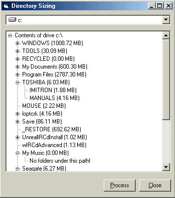



## Directory Sizer

### Description

Suffering with the problem of lack of disk space I knew there must be a directory on my hard disk that contained a lot of information, this is why I wrote this application. Its simple in what it does but can provide useful information about your hard disk space. It allows you to select a drive and then by using a tree control lets you navigate through it displaying hard disk usage for each folder it sees..
 
### More Info
 
A Drive control is used to get the required drive you wish to scan.

Very straight forward.

Displays hard disk usage in a tree view.

None that I know of!

             |
---                |---
**Submitted On**   |2002-05-13 13:50:44
**By**             |[Xaiin](https://github.com/Planet-Source-Code/PSCIndex/blob/master/ByAuthor/xaiin.md)
**Level**          |Beginner
**User Rating**    |5.0 (75 globes from 15 users)
**Compatibility**  |VB 5\.0, VB 6\.0
**Category**       |[Files/ File Controls/ Input/ Output](https://github.com/Planet-Source-Code/PSCIndex/blob/master/ByCategory/files-file-controls-input-output__1-3.md)
**World**          |[Visual Basic](https://github.com/Planet-Source-Code/PSCIndex/blob/master/ByWorld/visual-basic.md)
**Archive File**   |[Directory\_825275132002\.zip](https://github.com/Planet-Source-Code/xaiin-directory-sizer__1-34749/archive/master.zip)

